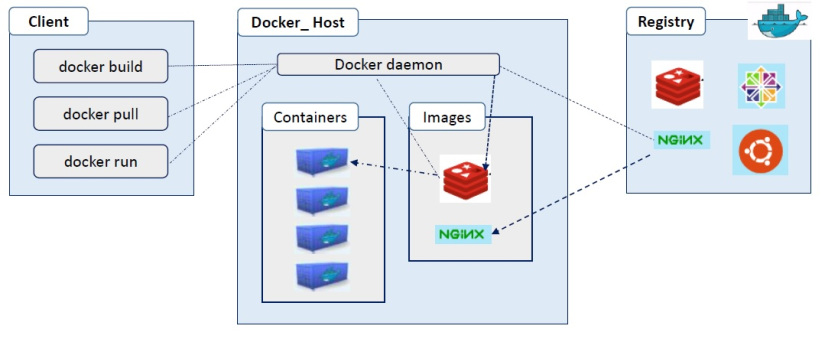

In this module we are going to learn about

  * Introduction to Docker
  * Docker Architecture
  * Anatomy of a Container: Namespaces, Cgroups and OverlayFS
  * Understanding Virtualization
  * Virtualization vs Container

## Introduction to Docker
Docker is an open platform for developing, shipping & running distributed applications, whether on laptops, data center VMs or cloud. Docker provides the ability to package and run an application in a loosely isolated environment called a container. The Docker Platform consists of multiple product/tools, including the Docker Engine, Images, Containers, and Hub, among others.

The Docker platform is the only container platform to build, secure and manage the widest array of applications from development to production both on premises and in the cloud.

## Docker Architecture

## Anatomy of a Container

#### Namespaces
Docker makes use of kernel namespaces to provide the isolated workspace called the container. When you run a container, Docker creates a set of namespaces for that container. These namespaces provide a layer of isolation. Each aspect of a container runs in a separate namespace and its access is limited to that namespace.

Docker Engine uses the following namespaces on Linux:

  This text is purple, <a href="#" class="text-inherit">including the link</a>

  * PID namespace for process isolation.
  * NET namespace for managing network interfaces.
  * IPC namespace for managing access to IPC resources.
  * MNT namespace for managing filesystem mount points.
  * UTS namespace for isolating kernel and version identifiers

